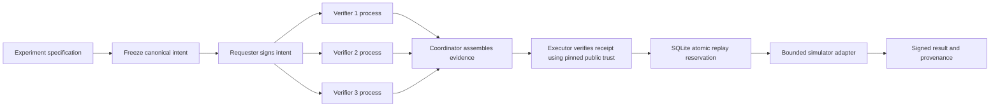

# ProofGate-PQ

**Intent -> Independent Verification -> Cryptographic Receipt -> Execution**

ProofGate-PQ is a compact, MIT-licensed prototype for evidence-bound authorization of
machine actions. A signed request expresses intent. It does not grant permission.
Distinct verifier identities check the frozen action under a pinned policy and sign
their findings. A protected executor independently verifies the resulting receipt,
atomically spends the permit and only then runs the action.

The reference action is a local quantum experiment. Its specification is frozen before
authorization; changing its circuit, shot count, seed, backend or other bound fields
invalidates authorization. The executor signs the resulting provenance record.

**This is not production-ready, independently audited, FIPS-validated, or a proof of
correct quantum computation.** No paid quantum provider or remote service is used.

## Why separate authorization and execution?

A user, application or autonomous agent can request the wrong action, supply ambiguous
parameters, or retry an already executed request. The execution boundary should receive
evidence about exactly what was checked rather than trusting the caller's assertion.
ProofGate-PQ makes that boundary visible in `ProtectedExecutor.execute`: receipt validation,
durable replay reservation and the simulator call occur in that order. A bare intent,
coordinator decision, missing signature or human-review disposition cannot execute.

UNKNOWN, ERROR, HUMAN_VERIFY and DENY are never approvals. Only a verified ALLOW with
enough distinct authenticated verifier attestations is an authorization. Signature,
policy, schema, provider, clock and replay-store errors all fail closed.

## Why post-quantum signatures?

Future cryptographically relevant quantum computers threaten conventional public-key
cryptography. NIST finalized ML-KEM for key establishment and ML-DSA/SLH-DSA for signatures
in August 2024. Migration involves applications, keys, protocols and operational controls,
not merely swapping a function. [NIST standards announcement](https://csrc.nist.gov/News/2024/postquantum-cryptography-fips-approved),
[NCCoE migration project](https://www.nccoe.nist.gov/applied-cryptography/migration-to-pqc).

This prototype compares a classical baseline, a standardized PQ signature primitive and
an explicitly composed dual-signature mode. The detailed [research record](docs/research.md)
distinguishes standards, draft guidance, implementation choices and assumptions. Research
was performed before the major implementation; the [threat model](docs/architecture.md)
was written first.

## Architecture



The coordinator has no authorization signing key. Each attestation signs a common header
plus verifier identity, disposition and predicates. The header binds:

- Canonical action digest and policy identifier, version and content digest.
- Required suite, executor audience, eligible verifier set and quorum.
- Issuance, expiration and a fresh receipt identifier.

The intent binds schema version, action type, requester, target, parameters, environment,
project, audience, nonce, validity, policy reference and required suite. Parameters include
the complete experiment and its frozen digest. The executor pins policy and public keys
outside the receipt. Receipt-controlled downgrade, trust-key replacement or policy lookup
is not supported.

`PGJ-1` canonicalization sorts ASCII object keys and uses compact deterministic JSON,
bounded integers and printable ASCII strings. It rejects duplicate keys, floats,
non-finite numbers, Unicode strings, unknown fields, oversized documents and excessive
depth. It is intentionally narrower than general JSON and is **not** claimed to implement
RFC 8785. Whitespace and object key order in transport do not change canonical bytes.
SHA-384 digests include protocol/domain prefixes. See [schemas](schemas/) and
[protocol specification](docs/protocol.md).

## What independent verification establishes

The default cluster starts three separate OS processes with separate signing keys and
identities. It supports 2-of-3 and 3-of-3. Each node independently authenticates the requester,
checks the pinned policy/header and evaluates the same explicit predicates:

| Predicate | Meaning |
|---|---|
| Requester, target, audience and context | Match local allowlists and executor scope |
| Frozen specification | Its canonical digest matches the frozen digest |
| Resource limits | Qubit/shot counts stay within the policy bounds |
| Circuit semantics | Allowed gate arity, distinct operands and in-range qubit indices |
| Backend | The supported local simulator revision is selected |
| Automatic review | High shot counts require HUMAN_VERIFY, which cannot execute |

The executor recomputes these predicates as well as checking signatures. A valid signature
on false or inconsistent evidence is rejected. Duplicate identities or shared component
keys masquerading as separate identities cannot establish quorum.

A quorum establishes authenticated agreement on these predicates. It does **not** establish
scientific truth. Local processes share code, host, filesystem owner and input, so this
demonstration does not provide independent administrative fault domains. A malformed included
attestation rejects the receipt; a coordinator may assemble a valid subset meeting the pinned
threshold. Removing surplus approvals can preserve authorization. This is threshold approval,
not an immutable outer envelope or a deny-veto protocol.

## Cryptographic choices

| Suite | Required signatures | Purpose |
|---|---|---|
| `ed25519-v1` | Ed25519 | Conventional comparison; not quantum-resistant |
| `mldsa65-v1` | ML-DSA-65 | PQ authorization with a FIPS 204 primitive |
| `ed25519-mldsa65-v1` | Ed25519 **AND** ML-DSA-65 | Default explicit dual mode |

Requester, verifier and result identities all use the policy's suite. Both hybrid
components sign the identical domain-separated envelope containing suite, signer and body.
Exact component-set checking rejects absent or extra signatures. There is no fallback when
a required provider or algorithm is unavailable. Private/public key handling and signatures
use PyCA cryptography/OpenSSL; no cryptographic primitive is implemented here.

NIST describes dual signatures as requiring all components to verify. This repository's
composition and wire protocol are application engineering, not a NIST-approved composite
protocol. [NIST FAQ](https://csrc.nist.gov/Projects/post-quantum-cryptography/faqs).

ML-KEM is omitted because local signed receipts do not establish encryption keys. SLH-DSA
was researched and deferred: no demonstrated archival/diversity requirement justifies a
second provider adapter here, and the pinned PyCA installation does not expose it. Neither
algorithm is substituted or benchmarked under a misleading name. See [research](docs/research.md).

## Quick start

Python 3.12 is the tested interpreter. Windows PowerShell:

```powershell
cd C:\Users\amitb\Documents\ProofGate-PQ
python -m venv .venv
.\.venv\Scripts\Activate.ps1
python -m pip install --require-hashes -r requirements-dev.lock
python -m pip install --no-deps --no-build-isolation -e .
python -m proofgate --root .demo-mine quantum-demo
```

Linux/macOS setup uses `python3 -m venv .venv` and `source .venv/bin/activate`; the remaining
Python commands are the same. A Windows/Linux CI matrix is provided, but this delivery's
recorded run is Windows only. Runtime-only dependencies are in `requirements.lock`.
The development lock also supplies the pinned build backend for editable installation.

Use a new `--root` directory for each demo; provisioning refuses to overwrite existing
keys or replay state. Demo roots contain **plaintext private keys** and are ignored by Git.
The tool does not configure Windows ACLs or separate service accounts.

## Step-by-step workflow

All commands below use the activated environment. Put `--root` before the subcommand.

```powershell
python -m proofgate --root .demo-manual init --quorum 2
# Edit .demo-manual/experiment.json if desired, then freeze it:
python -m proofgate --root .demo-manual freeze
python -m proofgate --root .demo-manual sign-intent
python -m proofgate --root .demo-manual authorize
python -m proofgate --root .demo-manual inspect
python -m proofgate --root .demo-manual verify
python -m proofgate --root .demo-manual execute
python -m proofgate --root .demo-manual verify-result
python -m proofgate --root .demo-manual execute
# Last command must exit 2 with {"status":"REJECTED","code":"REPLAY"}.
```

Receipts last 120 seconds by default. Finish the sequence within that window. If a
receipt expires, obtain a fresh one for an unspent intent; reissuing a receipt for an
already spent intent still fails replay. `verify` checks current cryptographic authorization
without checking/consuming replay state. Only `execute` makes the atomic spend decision.
`verify-result` verifies historical provenance and never grants new permission.

Other principal commands:

```powershell
python -m proofgate --root .demo-three quantum-demo --quorum 3
python -m proofgate --root .demo-pq quantum-demo --suite mldsa65-v1
python -m proofgate attacks
python -m pytest -q --junitxml=reports/tests.xml
python -m ruff check src tests
python -m ruff format --check src tests
python -m mypy src/proofgate
python -m proofgate benchmark --samples 30 --process-samples 5
python -m proofgate schemas
```

The CLI exits nonzero with stable structured rejection codes rather than including secret
key material or provider exception details. No network server, cloud account, containers
or quantum SDK are necessary for the default demonstration.

## Recorded adversarial and property tests

The recorded run has **179 passing tests**. The explicit corpus has **44 cases**, run
against each of the three suites in pytest (132 checks). It includes all requested attack
categories and additional trust, parsing, policy, audience, domain and replay attacks.
See the complete [attack matrix](reports/attacks.md), [machine-readable corpus](reports/attacks.json)
and [JUnit results](reports/tests.xml).

| Attack family | Observed outcome |
|---|---|
| Valid receipt; valid two-signer subset | ALLOW |
| Action, target, frozen spec or signed evidence changed | Rejected |
| Wrong key, missing hybrid component, swapped/domain-substituted signature | Rejected |
| Suite, policy version/content, quorum or audience changed | Rejected |
| Expired/future receipts, future/expired intents | Rejected |
| Duplicate/unknown verifiers or reused identity key | Rejected |
| Insufficient approvals, signed false evidence, malicious approval of a denied action | Rejected |
| DENY/HUMAN_VERIFY/UNKNOWN/ERROR presented for execution | Rejected |
| Same receipt or reissued receipt for a spent intent | REPLAY |
| Result counts changed after signing | Rejected |
| Six simultaneous executor processes using one receipt | One execution, five REPLAY rejections |

Generative tests exercise field mutations, PQ signature bit mutations, canonical round trips,
key-order invariance, signer-order invariance and repeated identities. Exhaustive leaf tests
cover all 24 manifest leaf fields and every attestation-body leaf in the reference example.
Additional executor tests cover absent receipts, storage errors, expiry during reservation,
failed adapters burning permits, snapshot isolation and historical provenance.

## Recorded benchmarks

Measured locally on Windows 11, Python 3.12.10, cryptography 49.0.0, OpenSSL 4.0.1; 30 API
samples and five process samples per suite. Medians below are milliseconds. The raw
[benchmark JSON](reports/benchmark.json) records every sample and environment metadata;
the [generated report](reports/benchmark.md) includes key generation, signing, verification,
quorum, full authorization, process authorization, throughput and sizes.

| Suite | Sign ms | Verify ms | Full auth ms | Receipt bytes |
|---|---:|---:|---:|---:|
| Ed25519 | 0.036 | 0.049 | 2.640 | 3,367 |
| ML-DSA-65 | 0.570 | 0.115 | 7.697 | 16,345 |
| Dual | 0.539 | 0.166 | 8.944 | 16,680 |

These measure the suite API, including Python/key import/serialization costs. Full authorization
includes all three in-process votes and independent receipt verification. Separate fresh-process
medians were roughly 486–781 ms, dominated by startup and scheduling. Small samples and differing
load explain apparent ordering differences; do not infer that dual signatures intrinsically sign
faster than ML-DSA alone. No receipt-size or timing values are extrapolated for omitted algorithms.
See [methodology](docs/benchmark-methodology.md).

## Quantum experiment provenance

The reference circuit is `H(0); CX(0,1)` on two qubits, 1,024 shots, seed 7. Output bitstrings
use `|q1 q0>` order. The recorded simulator output was `00: 546`, `11: 478`. The demo:

1. Freezes and signs the specification.
2. Obtains authenticated attestations from three process identities.
3. Rejects a changed shot count with `SIGNATURE_INVALID` before execution.
4. Executes the authorized snapshot once and signs its result.
5. Verifies the provenance independently and rejects replay after constructing a new executor.

The result binds counts, backend revision, executor identity, execution time and action,
frozen-spec and receipt digests. It is tamper-evident under the pinned executor key.
It is not a proof of scientific validity or computational correctness. The clean
`SimulatorAdapter` interface is the extension point for a future provider; any real backend
needs credential isolation, explicit schema/policy changes and idempotent execution handling.

## Replay and trust assumptions

SQLite reserves both a receipt ID and `(audience, subject, intent nonce)` under a transaction
before the adapter runs. Every process serving that audience must share the same durable
database. Reservations remain spent after failure. This is **at-most-once admission**, not
guaranteed execution, result delivery or exactly-once distributed effects. Database deletion,
rollback, separate database paths and clock compromise invalidate the replay/expiry assumptions.

The executor must exclusively control backend credentials, signing keys and execution code
in a real deployment. A local Python owner can bypass Python and run a different simulator;
this prototype cannot prevent that. Verifier trust anchors and policy are administrative
inputs, not untrusted data discovered inside receipts. Updating policy contents rejects old
receipts even if the version label was mistakenly reused; retain old trust snapshots for audit.

## Repository

```text
ProofGate-PQ/
  README.md, LICENSE, SECURITY.md
  pyproject.toml, requirements*.in, requirements*.lock
  .github/workflows/ci.yml
  docs/
    architecture.md, research.md, protocol.md
    benchmark-methodology.md, limitations.md
  examples/                 # Frozen experiment and policy examples; no private keys
  schemas/                  # Generated structural JSON schemas
  src/proofgate/
    canonical.py, models.py, crypto.py, policy.py
    protocol.py, node.py, local.py
    executor.py, simulator.py
    cli.py, demo.py, attacks.py, benchmark.py
  tests/                    # Corpus, properties, process/replay and simulator tests
  reports/                  # Actual test, attack, benchmark and public provenance artifacts
```

## Before any production use

Read the [threat model](docs/architecture.md), [security notes](SECURITY.md) and
[limitations and unsupported claims](docs/limitations.md). Required further work includes
independent protocol review, provider conformance/interoperability checks, secure key custody
and rotation, authenticated transport, independently operated verifiers, protected clocks,
rollback-resistant shared replay storage, backend credential isolation/idempotency, policy
governance, fuzzing, resource limits and audit/incident operations. CI is configured locally;
no repository was published and no external CI run or security audit was performed.
