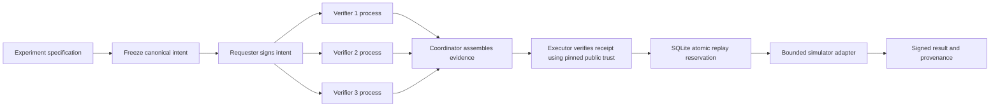

# ProofGate-PQ

[](https://github.com/amitb-quantum/proofgate-pq/actions/workflows/ci.yml)

**Verify the exact action before it executes — then make the authorization independently checkable.**

**Intent -> Independent Verification -> Cryptographic Receipt -> Execution -> Signed Provenance**

ProofGate-PQ is an MIT-licensed prototype for **evidence-bound, post-quantum authorization of machine actions**. A signed request expresses intent; it does not grant permission. Independent verifier identities evaluate a frozen action under a pinned policy and sign their findings. A protected executor independently verifies the resulting receipt, atomically spends the permit against replay, executes the exact approved workload and signs the resulting provenance.

The reference application is quantum computation: an experiment is frozen before authorization, and changing its circuit, shot count, seed, backend or any other bound field invalidates authorization.

**This is not production-ready, independently audited, FIPS-validated, or a proof of correct quantum computation.** No paid quantum provider or remote service is used.

## The problem

Modern software increasingly allows agents, applications and automated systems to perform high-consequence actions: deploy software, launch expensive compute jobs, publish artifacts, rotate credentials or execute scientific workloads.

A valid identity or digital signature proves **who requested an action**. It does not prove that:

- the exact action was independently checked;
- the applicable policy was satisfied;
- the request has not changed since approval;
- the authorization has not already been used; or
- the result is cryptographically bound back to what was authorized.

ProofGate-PQ separates **requesting an action** from **authorizing its execution**.

The executor acts only when presented with independently verifiable evidence that the exact frozen action satisfied the required policy.

## What ProofGate-PQ does

ProofGate-PQ turns authorization into a verifiable evidence object rather than a trusted coordinator decision.

A request is converted into a canonical frozen intent. Independent verifier identities evaluate that intent under a pinned policy and cryptographically attest their findings. A protected executor then independently re-validates the evidence, atomically reserves the authorization against replay, executes the exact approved workload and signs the resulting provenance record.

Fail-closed semantics are explicit:

- `ALLOW` can authorize execution.
- `DENY`, `HUMAN_VERIFY`, `UNKNOWN` and `ERROR` cannot.
- Missing evidence cannot authorize execution.
- Invalid or incomplete signatures cannot authorize execution.
- Changed policy, workload, backend or security-relevant parameters require fresh authorization.

## Why this is different

ProofGate-PQ is **not primarily a post-quantum signature demonstration**. ML-DSA is a standardized primitive; using it alone is not the differentiator.

The technical differentiation is the composition of:

- **Prospective freezing** — the action being approved is fixed before execution.
- **Evidence-bound authorization** — verifier attestations bind the exact action, policy, cryptographic suite, audience and quorum.
- **Independent enforcement** — the coordinator has no authorization signing key; the executor recomputes policy and verifies the receipt itself.
- **Post-quantum cryptographic agility** — Ed25519, ML-DSA-65 and explicit dual Ed25519 + ML-DSA-65 modes with no silent downgrade.
- **Replay-safe admission** — an authorization is atomically spent before side effects.
- **Backend binding** — execution backend and provider configuration are part of the authorized specification; switching CPU/GPU requires fresh authorization.
- **Signed provenance** — execution results are cryptographically bound to the action, frozen specification and authorization receipt.
- **Adversarial evidence** — property tests, explicit attack cases, concurrency tests, signed stress scenarios and a separate red-team pass exercise the design.
- **Measured execution** — the quantum reference workload includes actual CPU/GPU measurements rather than extrapolated performance claims.

The prototype does **not** claim that signatures prove scientific truth, correct computation or trustworthy hardware. Those remain separate assurance problems.

## Current WSL/GPU implementation

The authoritative development checkout was `~/proofgate-pq` in WSL Ubuntu 26.04 using the dedicated Conda environment `proofgate-pq` (Python 3.12.14). The Windows checkout and measurements are preserved as historical baseline artifacts. No host NVIDIA driver or unrelated environment was changed. See the [execution record](environment/README.md) and [AGENTS.md](AGENTS.md).

The versioned GPU demo executes a 24-qubit non-Clifford experiment behind the same protected boundary. On the recorded RTX 5090 system, measured simulation was **9.98x faster** than the fixed eight-thread CPU reference; the complete protected workflow was **5.18x faster**. Tiny circuits favor CPU. See the [measured GPU report](docs/gpu-results.md), [raw measurements](reports/gpu-benchmark.json), [complete workflow](reports/gateway-gpu-benchmark.md) and [red-team findings](docs/redteam-analysis.md).

Baseline commit: `702d66bcbfd65fa0bb584b5a882eadf613cb7a2c`. Current suite: **212 tests** with real GPU integration enabled. Eighteen new red-team hypotheses and 2,000 signed stress scenarios are preserved. No exploitable authorization bypass was confirmed in that model-led red-team pass; replay-store rollback, stale in-memory policy and false executor assertions remain explicit limits.

## Quick start

### CPU-only demonstration

Clone the repository and create the reproducible environment:

```bash
git clone https://github.com/amitb-quantum/proofgate-pq.git
cd proofgate-pq

conda env create -f environment/environment.yml
conda activate proofgate-pq

python -m pip install --require-hashes -r requirements-dev.lock
python -m pip install --no-deps --no-build-isolation -e .

python -m pytest -q
python -m proofgate --root .demo quantum-demo
```

Use a new `--root` directory for each demo; provisioning refuses to overwrite existing keys or replay state.

### NVIDIA GPU demonstration

On compatible Linux x86_64 with a supported NVIDIA GPU:

```bash
git clone https://github.com/amitb-quantum/proofgate-pq.git
cd proofgate-pq

conda env create -f environment/environment.yml
conda activate proofgate-pq

python -m pip install --require-hashes -r environment/requirements-gpu.lock
python -m pip install --no-deps --no-build-isolation -e .

PROOFGATE_GPU_TESTS=1 python -m pytest -q

python -m proofgate \
  --root .demo-gpu \
  gpu-demo \
  --qubits 24 \
  --layers 8 \
  --device GPU
```

GPU support is optional; the core authorization architecture does not require CUDA. The recorded reference system used an NVIDIA GeForce RTX 5090. All GPU runtimes were environment-local. See [environment/README.md](environment/README.md) for the exact tested setup and hash-locked recreation details.

## Why separate authorization and execution?

A user, application or autonomous agent can request the wrong action, supply ambiguous parameters or retry an already executed request. The execution boundary should receive evidence about exactly what was checked rather than trusting the caller's assertion.

ProofGate-PQ makes that boundary visible in `ProtectedExecutor.execute`: receipt validation, durable replay reservation and the simulator call occur in that order. A bare intent, coordinator decision, missing signature or human-review disposition cannot execute.

`UNKNOWN`, `ERROR`, `HUMAN_VERIFY` and `DENY` are never approvals. Only a verified `ALLOW` with enough distinct authenticated verifier attestations is an authorization. Signature, policy, schema, provider, clock and replay-store errors all fail closed.

## Why post-quantum signatures?

Future cryptographically relevant quantum computers threaten conventional public-key cryptography. NIST finalized ML-KEM for key establishment and ML-DSA/SLH-DSA for signatures in August 2024. Migration involves applications, keys, protocols and operational controls, not merely swapping a function. See the [NIST standards announcement](https://csrc.nist.gov/News/2024/postquantum-cryptography-fips-approved) and [NCCoE migration project](https://www.nccoe.nist.gov/applied-cryptography/migration-to-pqc).

This prototype compares a classical baseline, a standardized PQ signature primitive and an explicitly composed dual-signature mode. The detailed [research record](docs/research.md) distinguishes standards, draft guidance, implementation choices and assumptions. Research was performed before the major implementation; the [threat model](docs/architecture.md) was written first.

## Architecture



The coordinator has no authorization signing key. Each attestation signs a common header plus verifier identity, disposition and predicates. The header binds:

- canonical action digest and policy identifier, version and content digest;
- required suite, executor audience, eligible verifier set and quorum; and
- issuance, expiration and a fresh receipt identifier.

The intent binds schema version, action type, requester, target, parameters, environment, project, audience, nonce, validity, policy reference and required suite. Parameters include the complete experiment and its frozen digest. The executor pins policy and public keys outside the receipt. Receipt-controlled downgrade, trust-key replacement or policy lookup is not supported.

`PGJ-1` canonicalization sorts ASCII object keys and uses compact deterministic JSON, bounded integers and printable ASCII strings. It rejects duplicate keys, floats, non-finite numbers, Unicode strings, unknown fields, oversized documents and excessive depth. It is intentionally narrower than general JSON and is **not** claimed to implement RFC 8785. Whitespace and object key order in transport do not change canonical bytes. SHA-384 digests include protocol/domain prefixes. See [schemas](schemas/) and the [protocol specification](docs/protocol.md).

## What independent verification establishes

The default cluster starts three separate OS processes with separate signing keys and identities. It supports 2-of-3 and 3-of-3. Each node independently authenticates the requester, checks the pinned policy/header and evaluates the same explicit predicates:

| Predicate | Meaning |
|---|---|
| Requester, target, audience and context | Match local allowlists and executor scope |
| Frozen specification | Its canonical digest matches the frozen digest |
| Resource limits | Qubit/shot counts stay within the policy bounds |
| Circuit semantics | Allowed gate arity, distinct operands and in-range qubit indices |
| Backend | The supported local simulator revision is selected |
| Automatic review | High shot counts require HUMAN_VERIFY, which cannot execute |

The executor recomputes these predicates as well as checking signatures. A valid signature on false or inconsistent evidence is rejected. Duplicate identities or shared component keys masquerading as separate identities cannot establish quorum.

A quorum establishes authenticated agreement on these predicates. It does **not** establish scientific truth. Local processes share code, host, filesystem owner and input, so this demonstration does not provide independent administrative fault domains. A malformed included attestation rejects the receipt; a coordinator may assemble a valid subset meeting the pinned threshold. Removing surplus approvals can preserve authorization. This is threshold approval, not an immutable outer envelope or a deny-veto protocol.

## Cryptographic choices

| Suite | Required signatures | Purpose |
|---|---|---|
| `ed25519-v1` | Ed25519 | Conventional comparison; not quantum-resistant |
| `mldsa65-v1` | ML-DSA-65 | PQ authorization with a FIPS 204 primitive |
| `ed25519-mldsa65-v1` | Ed25519 **AND** ML-DSA-65 | Default explicit dual mode |

Requester, verifier and result identities all use the policy's suite. Both hybrid components sign the identical domain-separated envelope containing suite, signer and body. Exact component-set checking rejects absent or extra signatures. There is no fallback when a required provider or algorithm is unavailable. Private/public key handling and signatures use PyCA cryptography/OpenSSL; no cryptographic primitive is implemented here.

NIST describes dual signatures as requiring all components to verify. This repository's composition and wire protocol are application engineering, not a NIST-approved composite protocol. See the [NIST PQC FAQ](https://csrc.nist.gov/Projects/post-quantum-cryptography/faqs).

ML-KEM is omitted because local signed receipts do not establish encryption keys. SLH-DSA was researched and deferred: no demonstrated archival/diversity requirement justifies a second provider adapter here, and the pinned PyCA installation does not expose it. Neither algorithm is substituted or benchmarked under a misleading name. See [research](docs/research.md).

## Step-by-step workflow

All commands below use the activated environment. Put `--root` before the subcommand.

```bash
python -m proofgate --root .demo-manual init --quorum 2
# Edit .demo-manual/experiment.json if desired, then freeze it:
python -m proofgate --root .demo-manual freeze
python -m proofgate --root .demo-manual sign-intent
python -m proofgate --root .demo-manual authorize
python -m proofgate --root .demo-manual inspect
python -m proofgate --root .demo-manual verify
python -m proofgate --root .demo-manual execute
python -m proofgate --root .demo-manual verify-result
python -m proofgate --root .demo-manual execute
# Last command must exit 2 with {"status":"REJECTED","code":"REPLAY"}.
```

Receipts last 120 seconds by default. Finish the sequence within that window. If a receipt expires, obtain a fresh one for an unspent intent; reissuing a receipt for an already spent intent still fails replay. `verify` checks current cryptographic authorization without checking/consuming replay state. Only `execute` makes the atomic spend decision. `verify-result` verifies historical provenance and never grants new permission.

Other principal commands:

```bash
python -m proofgate --root .demo-three quantum-demo --quorum 3
python -m proofgate --root .demo-pq quantum-demo --suite mldsa65-v1
python -m proofgate attacks
python -m pytest -q --junitxml=reports/tests.xml
python -m ruff check src tests
python -m ruff format --check src tests
python -m mypy src/proofgate
python -m proofgate benchmark --samples 30 --process-samples 5
python -m proofgate gpu-benchmark --trials 7 --warmups 2
python -m proofgate gateway-benchmark --trials 7 --warmups 2
python -m proofgate schemas
```

The CLI exits nonzero with stable structured rejection codes rather than including secret key material or provider exception details. No network server, cloud account, containers or quantum SDK are necessary for the default CPU demonstration.

## Recorded adversarial and property tests

The original recorded run had **179 passing tests**; the current WSL/GPU suite has **212**. The explicit corpus has **44 cases**, run against each of the three suites in pytest (132 checks). It includes all requested attack categories and additional trust, parsing, policy, audience, domain and replay attacks. See the complete [attack matrix](reports/attacks.md), [machine-readable corpus](reports/attacks.json), [red-team analysis](docs/redteam-analysis.md) and recorded test artifacts under `reports/`.

| Attack family | Observed outcome |
|---|---|
| Valid receipt; valid two-signer subset | ALLOW |
| Action, target, frozen spec or signed evidence changed | Rejected |
| Wrong key, missing hybrid component, swapped/domain-substituted signature | Rejected |
| Suite, policy version/content, quorum or audience changed | Rejected |
| Expired/future receipts, future/expired intents | Rejected |
| Duplicate/unknown verifiers or reused identity key | Rejected |
| Insufficient approvals, signed false evidence, malicious approval of a denied action | Rejected |
| DENY/HUMAN_VERIFY/UNKNOWN/ERROR presented for execution | Rejected |
| Same receipt or reissued receipt for a spent intent | REPLAY |
| Result counts changed after signing | Rejected |
| Six simultaneous executor processes using one receipt | One execution, five REPLAY rejections |

Generative tests exercise field mutations, PQ signature bit mutations, canonical round trips, key-order invariance, signer-order invariance and repeated identities. Exhaustive leaf tests cover all 24 manifest leaf fields and every attestation-body leaf in the reference example. Additional executor tests cover absent receipts, storage errors, expiry during reservation, failed adapters burning permits, snapshot isolation and historical provenance.

The later red-team continuation recorded **18 additional hypotheses**. It confirmed no exploitable acceptance defect under the documented threat model, while identifying explicit design limitations and assumption violations around replay-store rollback, loaded policy state, trusted executor assertions and equivalent valid signature envelopes. That is **not** a formal verification or independent security audit.

## GPU workload and measured results

The larger reference workload is a 24-qubit, 568-gate, 8-layer H/T/CX circuit with 1,024 shots and fixed generation/sampling seeds. T gates make it non-Clifford; the double-precision statevector is 256 MiB. The same protected executor validates hybrid 3-of-3 evidence, reserves the nonce in SQLite, invokes the selected backend and signs provenance. CPU/GPU selection is itself bound into authorization, and GPU failure does not silently fall back to CPU.

Seven steady-state trials followed two warmups per workload. CPU/GPU order was alternated and completion synchronized. Raw data includes all measured trials and environment metadata.

| Workload | CPU median | GPU median | Observation |
|---|---:|---:|---|
| 2-qubit non-Clifford test | 0.563 ms | 1.606 ms | GPU slower |
| 16-qubit statevector | 9.864 ms | 9.919 ms | Roughly tied |
| 20-qubit statevector | 63.581 ms | 17.612 ms | GPU 3.61x faster |
| 24-qubit statevector | 1,251.097 ms | 125.364 ms | GPU 9.98x faster |
| Complete protected 24-qubit workflow | 1,421.534 ms | 274.465 ms | GPU 5.18x faster overall |

Authorization itself remained approximately 114 ms on either device and stayed on CPU. A separate 24-thread CPU measurement returned a 1,240.595 ms median. Small simulations and report-sized statistical analysis favored CPU execution. See [GPU results](docs/gpu-results.md) and [benchmark methodology](docs/benchmark-methodology.md).

No suitable maintained GPU SHA-384/protocol-signature integration was established. PyCA signature APIs are CPU here. No GPU cryptographic acceleration claim is made.

## Original Windows baseline benchmarks

Measured locally on Windows 11, Python 3.12.10, cryptography 49.0.0 and OpenSSL 4.0.1; 30 API samples and five process samples per suite. Medians below are milliseconds. The raw [benchmark JSON](reports/benchmark.json) records every sample and environment metadata; the [generated report](reports/benchmark.md) includes key generation, signing, verification, quorum, full authorization, process authorization, throughput and sizes.

| Suite | Sign ms | Verify ms | Full auth ms | Receipt bytes |
|---|---:|---:|---:|---:|
| Ed25519 | 0.036 | 0.049 | 2.640 | 3,367 |
| ML-DSA-65 | 0.570 | 0.115 | 7.697 | 16,345 |
| Dual | 0.539 | 0.166 | 8.944 | 16,680 |

These measure the suite API, including Python/key import/serialization costs. Full authorization includes all three in-process votes and independent receipt verification. Separate fresh-process medians were roughly 486-781 ms, dominated by startup and scheduling. Small samples and differing load explain apparent ordering differences; do not infer that dual signatures intrinsically sign faster than ML-DSA alone. No receipt-size or timing values are extrapolated for omitted algorithms. See [methodology](docs/benchmark-methodology.md).

## Quantum experiment provenance

The original reference circuit is `H(0); CX(0,1)` on two qubits, 1,024 shots, seed 7. Output bitstrings use `|q1 q0>` order. The recorded simulator output was `00: 546`, `11: 478`. The demo:

1. freezes and signs the specification;
2. obtains authenticated attestations from three process identities;
3. rejects a changed shot count with `SIGNATURE_INVALID` before execution;
4. executes the authorized snapshot once and signs its result; and
5. verifies the provenance independently and rejects replay after constructing a new executor.

The result binds counts, backend revision, executor identity, execution time and action, frozen-spec and receipt digests. It is tamper-evident under the pinned executor key. It is not a proof of scientific validity or computational correctness. The `SimulatorAdapter` interface is the extension point for a future provider; any real backend needs credential isolation, explicit schema/policy changes and idempotent execution handling.

## Replay and trust assumptions

SQLite reserves both a receipt ID and `(audience, subject, intent nonce)` under a transaction before the adapter runs. Every process serving that audience must share the same durable database. Reservations remain spent after failure. This is **at-most-once admission**, not guaranteed execution, result delivery or exactly-once distributed effects. Database deletion, rollback, separate database paths and clock compromise invalidate the replay/expiry assumptions.

The executor must exclusively control backend credentials, signing keys and execution code in a real deployment. A local Python owner can bypass Python and run a different simulator; this prototype cannot prevent that. Verifier trust anchors and policy are administrative inputs, not untrusted data discovered inside receipts. Updating policy contents in a newly loaded executor trust snapshot rejects old receipts even if the version label was mistakenly reused; retain old trust snapshots for audit.

## Repository

```text
ProofGate-PQ/
  README.md, LICENSE, SECURITY.md
  pyproject.toml, requirements*.in, requirements*.lock
  .github/workflows/ci.yml
  environment/
    README.md, environment.yml, requirements-gpu.lock
  docs/
    architecture.md, research.md, protocol.md
    benchmark-methodology.md, gpu-design.md, gpu-results.md
    limitations.md, redteam-analysis.md
  examples/                 # Frozen experiment and policy examples; no private keys
  schemas/                  # Generated structural JSON schemas
  src/proofgate/
    canonical.py, models.py, crypto.py, policy.py
    protocol.py, node.py, local.py
    executor.py, simulator.py
    cli.py, demo.py, attacks.py, benchmark.py
  scripts/                  # GPU, CPU sensitivity, stress and red-team helpers
  tests/                    # Corpus, properties, process/replay, simulator and GPU tests
  reports/                  # Actual test, attack, benchmark and public provenance artifacts
```

## Before any production use

Read the [threat model](docs/architecture.md), [security notes](SECURITY.md) and [limitations and unsupported claims](docs/limitations.md). Required further work includes independent protocol review, provider conformance/interoperability checks, secure key custody and rotation, authenticated transport, independently operated verifiers, protected clocks, rollback-resistant shared replay storage, backend credential isolation/idempotency, policy governance, fuzzing, resource limits and audit/incident operations.

The repository is public. GitHub Actions has passed on both Ubuntu and Windows; the badge above tracks the current main-branch workflow. CI runs the CPU test suite, lint, formatting, type checks, attack corpus and three-verifier demonstration; GPU integration tests require a separate explicit opt-in. The Aer extension also requires its optional GPU dependency lock. Running executors do not watch policy files for changes; replace their loaded trust configuration explicitly.
